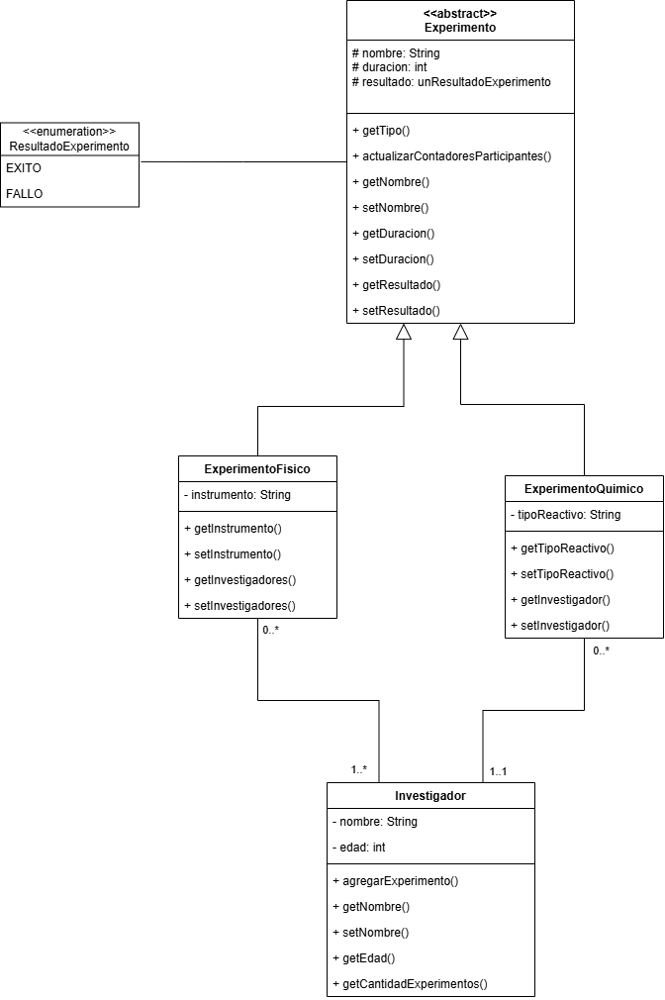

# TPI 1 - Laboratorio Chad
Este proyecto es un sistema de gestión para un centro de investigación escolar, desarrollado en Java y gestionado con Maven. Permite a los usuarios registrar investigadores y experimentos (físicos y químicos), y luego consultar estadísticas y generar reportes.

## Diagrama de clases


## 📋 Requisitos Previos
Para compilar y ejecutar este proyecto, necesitarás tener instalado:

Java JDK 11 (o superior).

Apache Maven (versión 3.6 o superior).

## 🚀 Instalación y Compilación
El proyecto utiliza Maven para gestionar sus dependencias y ciclo de vida. Para compilar el proyecto y generar el archivo .jar ejecutable, sigue estos pasos:

Abre una terminal o línea de comandos.

Navega hasta el directorio raíz del proyecto (la carpeta TPI 1/ que contiene el archivo pom.xml).

Ejecuta el siguiente comando Maven:

```
mvn clean package
```

Este comando limpiará compilaciones anteriores, compilará el código, ejecutará las pruebas y empaquetará la aplicación en un archivo .jar.

Encontrarás el archivo ejecutable en la carpeta target/, con un nombre similar a TPI-1-1.0-SNAPSHOT.jar.

## ▶️ Cómo Ejecutar el Proyecto
Una vez que el proyecto esté compilado, puedes ejecutarlo de la siguiente manera:

### Usando el Plugin exec de Maven (Recomendado)
Esta es la forma más directa de ejecutar la aplicación sin construir el JAR primero.

Asegúrate de estar en la carpeta raíz del proyecto (TPI 1/).

Ejecuta el siguiente comando:
```
mvn exec:java -Dexec.mainClass="com.laboratorio.Main"
```
(Esto le indica a Maven que ejecute el método main de la clase com.laboratorio.Main).